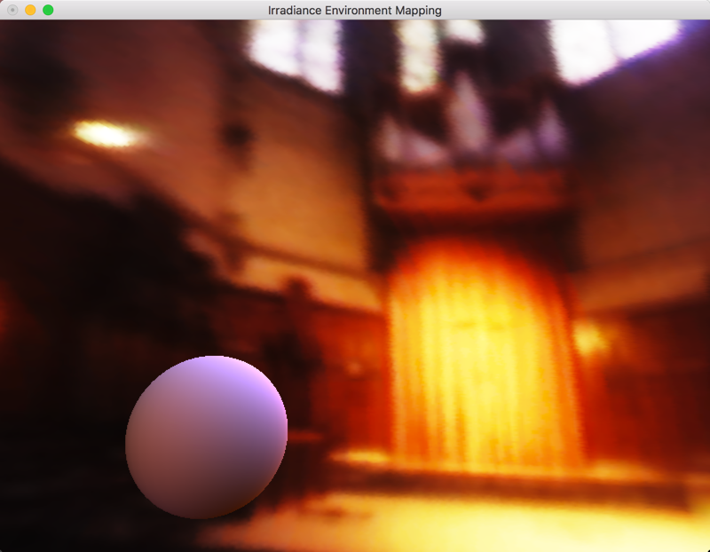

Use code tcoppex/m2-irradiance-env-map

test paper's result with misc testing code

Reference:

1. An Efficient Representation for Irradiance Environment Maps
2. http://www.rorydriscoll.com/2012/01/15/cubemap-texel-solid-angle/
3. https://nbertoa.wordpress.com/2017/07/16/lighting-series-part-3-radiance/
4. CodemapGen Code
5. https://seblagarde.wordpress.com/2012/01/08/pi-or-not-to-pi-in-game-lighting-equation/
6. Efficient Evaluation of Irradiance Environment Maps

--- ORIGINAL README ---

About

This project aims to implement Ravi Ramamoorthi & Pat Hanrahan's technique as described in their 2001 paper : "An Efficient Representation for Irradiance Environment Maps"

Compilation

Third parties used : -FreeImage 3 (as static library) -GLEW 1.7 (as static library create at compile-time) -GLSW (as static library create at compile-time) -GLM (as headers)

Controls

1, 2, 3 .. : Change the current cubemap.

left button + mouse : Rotate the camera.

←↑→↓ : Move the camera.

'r' : Toggle skybox auto-rotate.
